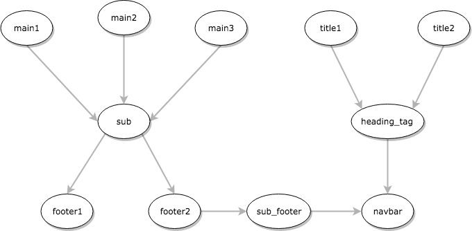

# P.O.C. Graphlib

Proof of Concept for [Graphlib](https://github.com/dagrejs/graphlib/wiki/API-Reference) module (graph database framework). The main idea is to use a graph as a solution for working with the content types of our stacks in [Contentstack](https://www.contentstack.com/).

* **Approach**: generate a graph whenever a structure is altered in Contentstack. We will only get the content types, not its content. The graph will be stored in local memory and due to this, we need to generate a new graph everytime the instance starts.

## Graph Generation

The algorithm for generating a graph will get the structure of a stack after a request on Contentstack's Content Delivery API:

```shell
REQUEST:
  * GET https://cdn.contentstack.io/v3/content_types

HEADERS:
  * api_key: {APY_KEY}
  * authtoken: {AUTH_TOKEN}
```

With the reseponse, the graph can be generated after passing through this piece of code (just a "sketch" version):

```javascript
let all = [];
content.forEach(contentType => {
  g.setNode(contentType.uid);
  const schema = contentType.schema;
  const references = schema
    .filter(dataType => dataType.data_type === 'reference')
    .map(destination => {
      console.log(`Seting edge from ${contentType.uid} to ${destination.uid} `);
      g.setEdge(contentType.uid, destination.uid);
      return destination.uid;
    });

  all.push({contentType: contentType.uid, references});

});
```

where `content` is the object `body.content_type` of the API's response.

## Getting Root Content Types

In order to get the content with the updated structure, we need to make a request on Contentstack's API with the root content types (i.e.: nodes that no one references, but makes references to other nodes). This will occur after a change in the structure.

Take the graph as example:



Passing a string with the content type id to the function getRoots() returns all the roots of a content type. Here is the code of the function:

```javascript
const getRoots = contentType => {
  const predecessors = g.predecessors(contentType);

  if (!predecessors) {
    throw new Error(`There is no content type named '${contentType}'`);
  }

  if (predecessors.length === 0) {
    return contentType;
  }

  return predecessors.map(contentType => getRoots(contentType));
}
```

For instance, if we want to get all the roots of `navbar`, we would do:

```javascript
const roots = getRoots('navbar');
const flattenRoots = _.flattenDeep(roots);
console.log(flattenRoots);
```

and get the epected result:

```shell-script
[ 'main', 'main2', 'main3', 'title1', 'title2' ]
```

## Conclusion

Graphlib is a module for dealing with graphs that will make it possible to map the structure of a Stack to a graph.

### Advantages

* Visibility of the graph in a JSON format;
* Provides data structures for undirected and directed multi-graphs;
* Provides algorithms for graph manipulation.

### Disadvantages

* Does not have an algorithm to get root nodes, given a node.